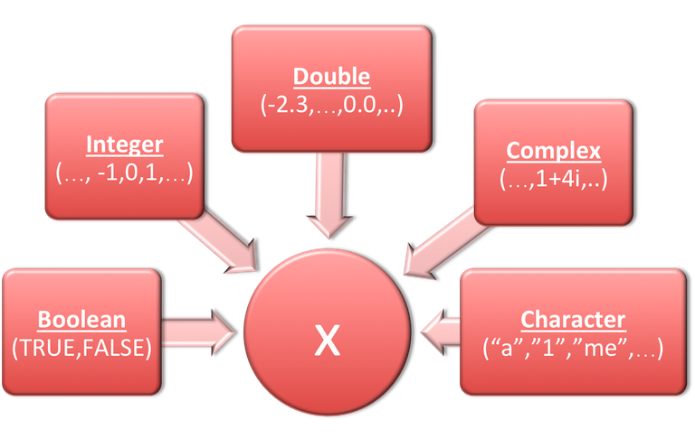
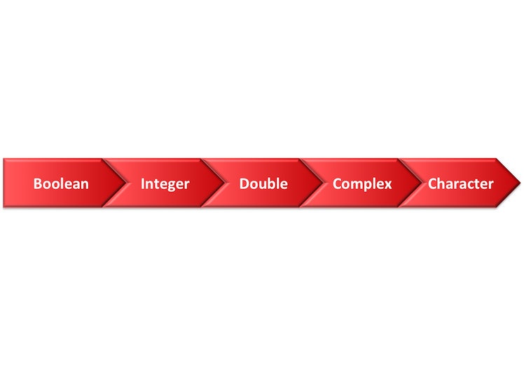
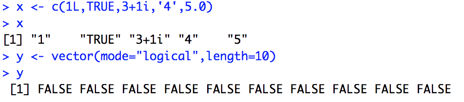
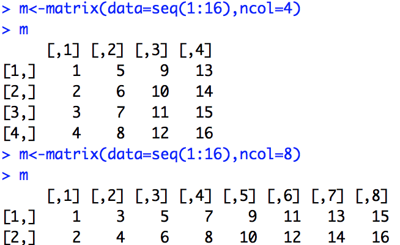
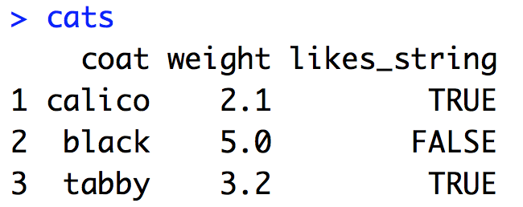
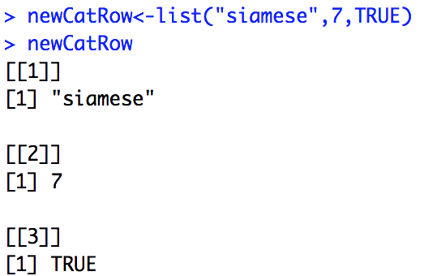

---

theme: sky
revealOptions:
    slideNumber: true

---

# Managing your projects with R studio

Note: The default keyboard shortcuts are:

* Up, Down, Left, Right: Navigation
* f: Full-screen
* s: Show slide notes
* o: Toggle overview
* . (Period or b: Turn screen black
* Esc: Escape from full-screen, or toggle overview

---

# Summary

---

## Base types 

---

## Type coercion

---

## R Data structures

* **vector** - 1d data must all be of the same type
* **matrix** - 2d data must all be of the same type
* **data.frame** - columns must be of the same type
* **factor** - sotres categorical data
* **list** - generic data
* ...

---

## Vectors

* There are no scalars in R
   * A scalar is a vector of length 1
* All elements MUST be of the same type
   * Be careful with type coercion

---

## Matrix

* Table of numbers all of the same type

---

## Data frame

* All the columns must be of the same type

---

## Lists

* Most generic data structure

