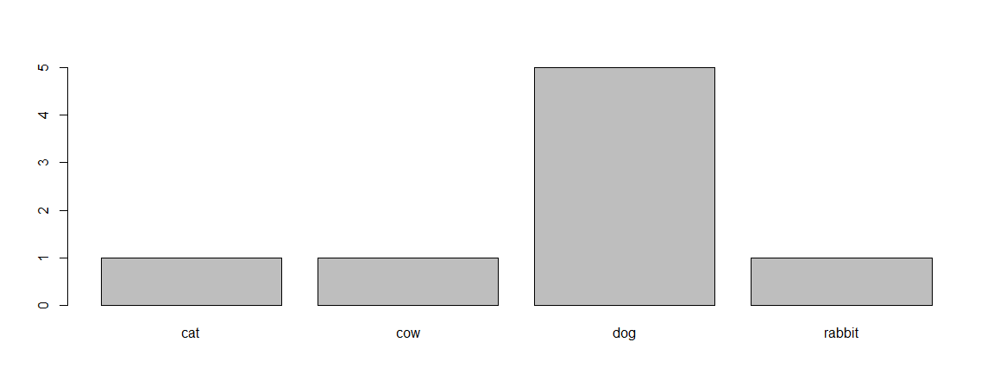
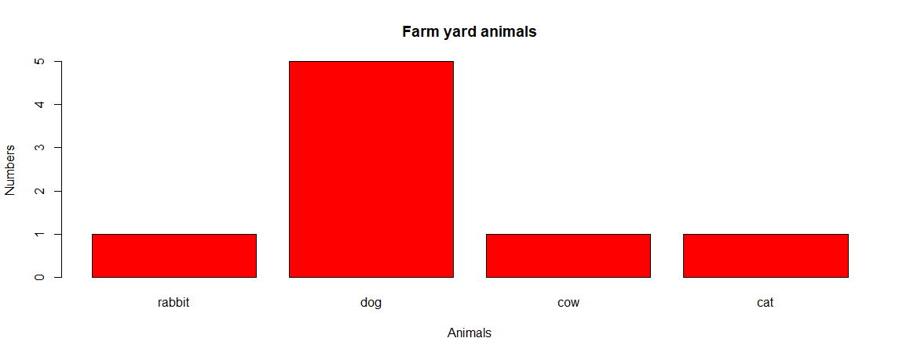

# Sample answers

## Contents

* [Introduction](#1-introduction)
* [Project management](#2-project-management)
* [Getting help](#3-getting-help)
* [Data structures](#4-data-structures)
* [Exploring data frame](#5-exploring-data-frames)
* [Subsetting data](#6-subsetting-data)
* [Control flow](#7-control-flow)
* [Quality Graphics](#9-quality-graphics)
* [Vectorisation](#9-vectorisation)
* [Functions](#10-functions)
* [Writing data](#11-writing-data)
* [Split-Apply-Combine](#12-split-apply-combine)
* [dplyr](#13-dplyr)
* [tidyr](#14-tidyr)
* [knitr](#15-knitr)
* [R and SQL](#16-r-and-sql)

## 1. Introduction

* 1.1 Which of the following are valid R-names?
    * `min_height` - valid.
    * `max.height` - valid.
    * `_age` - not valid, must starts with either a letter or a dot not followed by a number.
    * `.mass` - valid.
    * `MaxLength` - valid.
    * `min-length` - valid.
    * `2widths` - not valid, starts with a number.
    * `celsius2kelvin` - valid.

* 1.2 What will be the value of each variable after each statement in the following program?
    * `mass <- 47.5` - 47.5
    * `age <- 122` - 122.
    * `mass <- mass * 2.3` - 109.25
    * `age <- age - 20` - 102.

* 1.3 Calculate the Body Mass Index (BMI for a person)

```R
height <- 1.72               # height in metres
weight <- 82                 # weight in kg
bmi    <-  weight/height^2   # bmi is the weight divided by the square of the height.
# or
bmi <- weight/(height*height)
```

## 2. Project Management

* 2.1.1 Create a new git enabled project

 Create a new empty project `my_project2`. Make sure that this is git enabled.

 Add a `Readme.md` file (`File -> New File -> Text file`) with the following  text:

```
# My test project

This is my test Trieste repository.
```

then on Studio:

```
 File -> Save As...
```

 Call the file `Readme.md`. Save it at the root directory.
 Switch to the git window.  Add and commit this file with the `.gitignore` file. On RStudio see `Help->Markdown quick reference` to see what can be done.

* 2.1.2 Create GitHub repository and push the contents

 Go to your GitHub account and create a new repository for `my_project2`. When you create your project you should get instructions on how to push an existing project to GitHub. On the Git panel click on the `More` menu item and select `Shell...`. This will open up a shell command in the your new project directory. Type the commands GitHub is suggesting to you there (this should push up your project content to GitHub). You should now see your content on GitHub.

* 2.1.3 Modify your `Readme.md`

Modify your `Readme.md` file (add/remove content as you like). Save the file, commit the file (go to the Git panel select the file and then click on Commit). A window will come up where you need to put in a sensible commit message. Once this is done click on the Push button and that should push the contents to GitHub - do you see those changes?

* 2.1.4 Remotely modify your `Readme.md`

On GitHub click on the `Readme.md` file. Select Edit (the pencil), modify the content and save (add a sensible commit message there as well).

In RStudio, click on the Pull button. Do you see the changes you made being ported back to your local `Readme.md` version?

* 2.1.5 Ignoring files

 1. Create a directory within your project called graphs (in the files view click on the `New Folder` item).
 2. Modify the `.gitignore` file to contain graphs/ so that this disposable output isn’t versioned.
 3. Commit your `.gitignore` file.
 4. Push the content.

If you have managed to do all these steps you should now be in a position to  use Rstudio with GitHub (or any other remote git repository).

## 3. Getting help

* 3.1.1 what does the `c` function do? What do the following give you?
```R
c(1, 2, 3)
c('d', 'e', 'f')
c(1, 2, 'f')
```
These are called vectors, more about these later.

* 3.1.2 what does the `paste` function do?
```R
x <- c("fred","john")              # Create a vector 
paste(x,"one","two","three")
```
 What do the optional arguments "sep" and "collapse" do?
 i.e. `paste(x,"one","two","three", sep="-")` <br/>
What is the difference between `paste` and `paste0`?

*  3.1.3: how would you read a comma separated values (csv) type file that is tab (`\t`) delimited instead?<br/>
    **Hint**: use `??csv` to see what is available.

## 4. Data Structures

* 4.1.1 Coerce `character_coerced_to_numeric` to integers.

  ```R
  as.integer(character_coerced_to_numeric)
  ```

* 4.2.1 Do the following:

  1. Make a vector with the numbers 1 to 26.

     ```
     (myvec <- 1:26)
     ```

  2. Multiply these by 2.

     ```R
     (myvec <- myvec *2 )
     ```

  3. Name the elements (there is a built in vector called `letters` for small case letters `LETTERS` for capitals).

     ```R
     names(myvec) <- letters
     myvec
     # or if yu want to use capitals
     names(myvec) <- LETTERS
     myvec
     ```

* 4.2.2 What do you think the following will give you?

  ```R
  x <- seq(1,4)
  x+1
  [1] 2 3 4 5
  ```

  So what do you think the following will give you?

  ```R
  y <- seq(1,2)
  x+y
  [1] 2 4 4 6
  ```

  This happens because, as the `y` vector fits it is recycled so you get:

  ```
  (x[1]+y[1]]) (x[2]+y[1]]) (x[2]+y[1]]) (x[3]+y[1]]) (x[4]+y[2]])
  ```

  What about:

  ```R
  x*y
  [1] 1 4 3 8
  ```

  Similarly:

  ```
  (x[1]*y[1]]) (x[2]*y[1]]) (x[2]*y[1]]) (x[3]*y[1]]) (x[4]*y[2]])
  ```

* 4.3.1 The default behaviour for `read.csv` is to read strings as factors. Look up the documentation to find ways of not reading strings as factors.

  ```R
  cats <-read.csv(file="../data/feline-data.csv",stringsAsFactors = FALSE)
  ```

  Create a new vector that recovers the values from `factor_of_myvals`. Remember if you just use `as.integer` you get the index of the factor and not the values. 

  **Hint**: think of `as.character` but we do not want characters.

  ```R
  myvals <- c(1,2,3,3,2,1,10,2,5)
  factor_of_myvals <- factor(myvals)
  as.integer(as.character(factor_of_myvals))
  [1]  1  2  3  3  2  1 10  2  5
  ```

* 4.3.2 factors are good for doing quick plots:

  ```R
  animals <- factor(c("dog","cat","dog","cow","dog","dog","dog","rabbit"))
  plot(animals)
  ```

  

  Look up the documentation for plot and to this diagram do the following:

  1. Add a plot title "Farm yard animals"

  2. Add an x-axis title "Animals"

  3. Add a y-axis title "Numbers"

  4. Change the colour of the bars to "red"

  5. Reverse the ordering of the labels (this are coming from the levels) so you get "rabbit","dog","cow", "cat".

     ```R
     animals <- factor(c("dog","cat","dog","cow","dog","dog","dog","rabbit"),
                      levels=c("rabbit","dog","cow", "cat"))
     plot(animals, main="Farm yard animals",xlab="Animals",
          ylab="Numbers", col="red")
     ```

     

* 4.4.1 What do the following give you and what types do they return? Use `typeof()`, `class()` and `str()`

  ```R
  cats[1]
  cats[[1]]
  cats$coat
  cats["coat"]
  cats[1, 1]
  cats[, 1]
  cats[1, ]
  
  typeof(cats[1]); class(cats[1]); str(cats[1])
  [1] "list"
  [1] "data.frame"
  'data.frame':	3 obs. of  1 variable:
   $ coat: Factor w/ 3 levels "black","calico",..: 2 1 3
  
  typeof(cats[[1]]); class(cats[[1]]); str(cats[[1]])
  [1] "integer"
  [1] "factor"
   Factor w/ 3 levels "black","calico",..: 2 1 3
  
   typeof(cats$coat); class(cats$coat); str(cats$coat)
  [1] "integer"
  [1] "factor"
   Factor w/ 3 levels "black","calico",..: 2 1 3
  
  typeof(cats[1,1]); class(cats[1,1]); str(cats[1,1])
  [1] "integer"
  [1] "factor"
   Factor w/ 3 levels "black","calico",..: 2
  
  typeof(cats[,1]); class(cats[,1]); str(cats[,1])
  [1] "integer"
  [1] "factor"
   Factor w/ 3 levels "black","calico",..: 2 1 3
  
  typeof(cats[1,]); class(cats[1,]); str(cats[1,])
  [1] "list"
  [1] "data.frame"
  'data.frame':	1 obs. of  3 variables:
   $ coat        : Factor w/ 3 levels "black","calico",..: 2
   $ weight      : num 2.1
   $ likes_string: logi TRUE
  ```

* 4.5.1 What do you think will be the result of `length(matrix_example)`? 

  ```R
  length(matrix_example)
  [1] 18
  ```

* Make another matrix, this time containing the numbers 1:50 with 5 columns and 10 rows. Did the matrix function fill your matrix by column, or by row, as its default behaviour? Can you get it to fill the matrix the other way round?

  ```R
  (m <- matrix(1:50,ncol=5))
        [,1] [,2] [,3] [,4] [,5]
   [1,]    1   11   21   31   41
   [2,]    2   12   22   32   42
   [3,]    3   13   23   33   43
   [4,]    4   14   24   34   44
   [5,]    5   15   25   35   45
   [6,]    6   16   26   36   46
   [7,]    7   17   27   37   47
   [8,]    8   18   28   38   48
   [9,]    9   19   29   39   49
  [10,]   10   20   30   40   50
  
  (m <- matrix(1:50,ncol=5,byrow=TRUE))
        [,1] [,2] [,3] [,4] [,5]
   [1,]    1    2    3    4    5
   [2,]    6    7    8    9   10
   [3,]   11   12   13   14   15
   [4,]   16   17   18   19   20
   [5,]   21   22   23   24   25
   [6,]   26   27   28   29   30
   [7,]   31   32   33   34   35
   [8,]   36   37   38   39   40
   [9,]   41   42   43   44   45
  [10,]   46   47   48   49   50
  ```

* 4.5.3 Create a list of length two containing a character vector for each of the sections in this part of the workshop:

  * Data types:
    * 'double', 'complex', 'integer', 'character', 'logical'
  * Data structures:
    * 'data.frame', 'vector', 'factor', 'list', 'matrix'

  Populate each character vector with the names of the data types and data structures we’ve seen so far.

  ```R
  (mytypes <- list(
      dataTypes=c('double', 'complex', 'integer', 'character', 'logical'),
      dataStructs=c('double', 'complex', 'integer', 'character', 'logical')))
  
  $dataTypes
  [1] "double"    "complex"   "integer"   "character" "logical"  
  
  $dataStructs
  [1] "double"    "complex"   "integer"   "character" "logical" 
  ```

* 5.4 Consider the R output of the matrix below:

  ```
        [,1] [,2]
  [1,]    4    1
  [2,]    9    5
  [3,]   10    7
  ```

  What was the correct command used to write this matrix? Examine each command and try to figure out the correct one before running them. Think about what matrices the other commands will produce.

  ```R
  matrix(c(4, 1, 9, 5, 10, 7), nrow = 3)
  matrix(c(4, 9, 10, 1, 5, 7), ncol = 2, byrow = TRUE)
  matrix(c(4, 9, 10, 1, 5, 7), nrow = 2)
  matrix(c(4, 1, 9, 5, 10, 7), ncol = 2, byrow = TRUE) # This one
  ```

* 5.5 Consider:

  ```R
  m1 <- matrix(seq(1,16),ncol=4,nrow=4)
  m2 <- matrix(seq(16,1,-1),ncol=4,nrow=4)
  ```

  If you multiply these you get an elementwise multiplication:

  ```R
  m1*m2
       [,1] [,2] [,3] [,4]
  [1,]   16   60   72   52
  [2,]   30   66   70   42
  [3,]   42   70   66   30
  [4,]   52   72   60   16
  ```

  How would you get a proper get a proper matrix-matrix product? This is a question about using help (you don't have to understand matrix multiplication), remember "??" ?

  ```R
  m1 %*% m2
       [,1] [,2] [,3] [,4]
  [1,]  386  274  162   50
  [2,]  444  316  188   60
  [3,]  502  358  214   70
  [4,]  560  400  240   80
  ```


## 5. Exploring data frames

## 6. Subsetting data

## 7. Control flow

## 8. Quality graphics

## 9. Vectorisation

## 10. Functions

* 10.2.1 Test the GDP function by calculating the GDP for New Zealand in 1987. How does this differ from New Zealand’s GDP in 1952?

* 10.2.2 The paste function can be used to combine text together, e.g:
```R
best_practice <- c("Write", "programs", "for", "people", "not", "computers")
paste(best_practice, collapse=" ")
```
 Write a function called `fence` that takes two vectors as arguments,  called text and wrapper, and prints out the text wrapped with the wrapper:
````R
  fence(text=best_practice, wrapper="***")
````
Note: the paste function has an argument called `sep`, which specifies the separator between text. The default is a space: “ “. The default for `paste0` is no space “”.

## 11. Writing data

## 12. Split-Apply-Combine

* 1.1 Calculate the average life expectancy per continent. 
      Which has the longest? Which had the shortest?
```R
ddply(.data=gapminder,
      .variables="continent",
      .fun=function(x){c(mean=mean(x$lifeExp))}
)
```

* 1.2 Calculate the average life expectancy per continent and year. 
  Which had the longest and shortest in 2007? Which had the greatest change in between 1952 and 2007?

```R
gap_year_cont<- ddply(.data=gapminder,
                      .variables = c("continent","year"),
                      .fun=function(x){c(mean=mean(x$lifeExp))})
```
* 1.3 Calculate the difference in mean life expectancy between the years 1952 and 2007 from the output of challenge 2 using one of the `plyr` functions.

```R
ddply(.data=gap_year_cont,
.variables = "continent",
.fun=function(x){c(lifexpDiff=x$mean[x$year==2007]-x$mean[x$year==1952])})
```

## 13. dplyr

* 31.1.1 Write a single command (which can span multiple lines and includes pipes)
             that will produce a dataframe that has the African values for `lifeExp`, 
            `country` and `year`, but not for other Continents. How many rows does 
            your dataframe have and why?

```R
gapminder                   %>%
filter(continent=="Africa") %>%
select(year,country,lifeExp) -> lcy

nrow(gapminder)   # 1704
nrow(lcy)         #  624
```

* 13.2.1 Calculate the average life expectancy per country.
             Which has the longest average life expectancy and 
            which has the shortest average life expectancy?

```R
gapminder                            %>%
group_by(country)                    %>%
summarize(AverageLife=mean(lifeExp)) %>%
filter(AverageLife==min(AverageLife)|AverageLife == max(AverageLife))
```

* 13.2.2 Do the same thing but using the `arrange()` and `desc()` functions.

```R
# For the min
gapminder                            %>%
group_by(country)                    %>%
summarize(AverageLife=mean(lifeExp)) %>%
arrange(AverageLife)

# For the max
gapminder                            %>%
group_by(country)                    %>%
summarize(AverageLife=mean(lifeExp)) %>%
arrange(desc(AverageLife))
```

* 13.3.1 Calculate the average life expectancy in 2002 of 2 randomly selected 
      countries for each continent. Then arrange the continent names in 
      reverse order.<br>
      **Hint**: Use the `dplyr` functions `arrange()` and `sample_n()`, they have similar syntax to other `dplyr` functions.

```R
gapminder                                %>%
   filter(year==2002)                    %>%
   group_by(continent)                   %>%
   sample_n(2)                           %>%            # sample 2 rows per continent
   summarize(mean_lifeExp=mean(lifeExp)) %>%
   arrange(desc(mean_lifeExp))
```

## 14. tidyr

* 14.1.1 Is `gapminder` a purely long, purely wide, or some intermediate format?

* 14.1.2 Using `gap_long`, calculate the mean life expectancy, population, and `gdpPercap` 
     for each continent. Hint: use the `group_by()` and `summarize()` functions we learned in the `dplyr` lesson

```R
gap_long %>% group_by(continent,obs_type) %>% summarise(mean=mean(obs_values))
```

## 15. Tidyr

* 15.1 Remove the sections in your own markdown document and try some of the above markdown objects.

* 15.2 Add code chunks to your existing document that:
    * Load the `ggplot2` package
    * Read the `gapminder` data
    * Create a plot

* 15.3 Use chunk options to control the size of a figure and to hide the code.

* 15.4  Try out a bit of in-line R code.


## 16. R and SQL

* 16.1.1 Write a query that returns the number of rodents observed in each plot in each
             year.<br>
    **Hint**: Connect to the species table and write a query that joins the species and
      survey tables together to exclude all non-rodents. The query should return
      counts of rodents by year.
```      R
(species <- tbl(mammals,"species"))
(species %>% 
       filter(taxa == "Rodent") %>%
        inner_join(surveys) %>%
        group_by(species,year) %>%
        tally() %>%
        collect() -> rodents)
```

* 16.1.2 Write a query that returns the total number of rodents in each genus caught
      in the different plot types.<br>
      **Hint**: Write a query that joins the species, plot, and survey tables together.
            The query should return counts of genus by plot type.

```R
# There is nothing in species that we can join with plots so we must perform
# a preliminary join between surveys and plots.
surveys %>% inner_join(plots) %>% select(species_id,plot_type)-> surveys_plots

(
species                           %>% 
       filter(taxa=="Rodent")     %>% 
       inner_join(surveys_plots)  %>%
       group_by(genus,plot_type)  %>%
       tally()                    %>%
       collect() -> rodentcount
)
# or
(
surveys_plots                    %>%
       inner_join(species)       %>%
       group_by(genus,plot_type) %>%
       tally()                   %>%
       collect() -> rodentcount
)

# The whole thing can be made more compact
(
inner_join(surveys,plots)              %>%   # Do the inner join
          select(species_id,plot_type) %>%   # Reduce the amount of output
          inner_join(species)          %>%   # Join with species
          group_by(genus,plot_type)    %>% 
          tally()                      %>%
          collect() -> rodentcount
)
```

* 16.2.1 Add the remaining species table to the my_db database and run some of your queries from earlier in the lesson to verify that you have faithfully recreated the mammals database.

```R
copy_to(my_db, myspecies,temporary = FALSE)
```