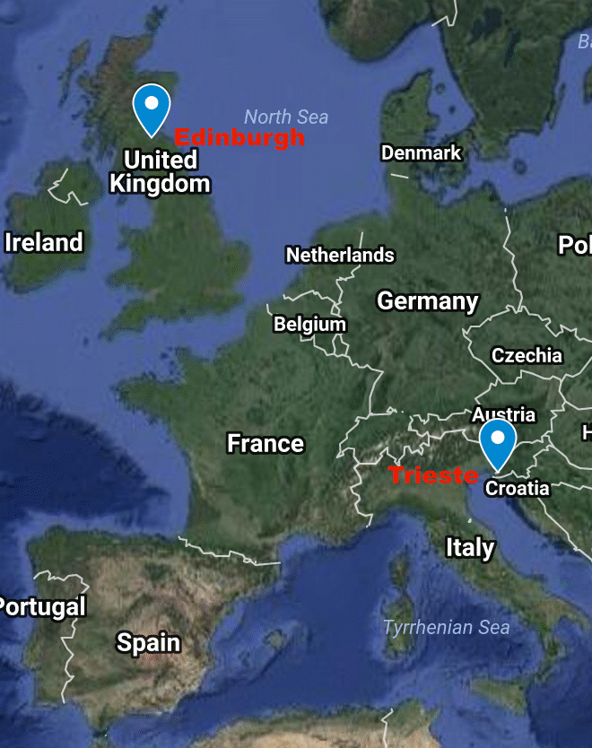
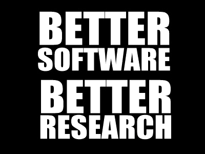
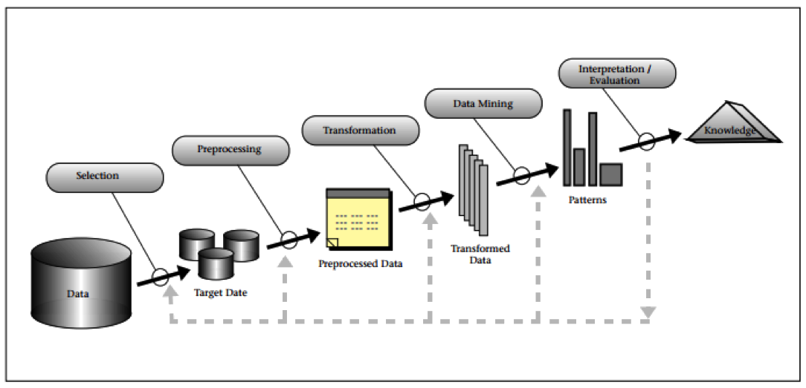
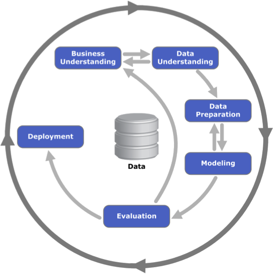
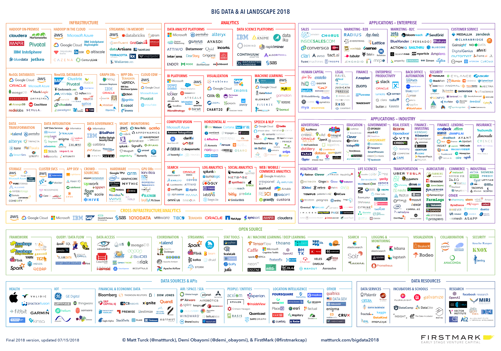
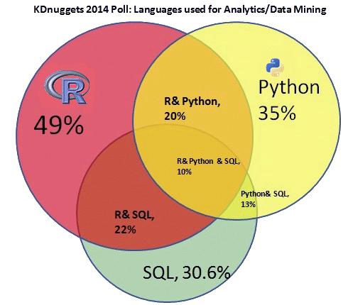

---

theme: sky
revealOptions:
    slideNumber: true

---

## Introduction

Note: 
To view the slides you will need to install
`reveal-md` (https://github.com/webpro/reveal-md)
you can use npm (https://www.npmjs.com/)
```
npm install -g reveal-md
```
and then view the slides using:
```
reveal-md introduction.md
```
The default keyboard shortcuts are:

* Up, Down, Left, Right: Navigation
* f: Full-screen
* s: Show slide notes
* o: Toggle overview
* . (Period or b: Turn screen black
* Esc: Escape from full-screen, or toggle overview

----

## Who I am

* Mario Antonioletti
   * m.antonioletti@epcc.ed.ac.uk
   * Work for EPCC (University of Edinburgh)
      * Software Sustainability Institute (SSI)
      * I am here with an SSI hat on

----

## Where I am from



Notes: 1936km, walking would take 341 hours including a ferry ride.
 
----

## EPCC

* https://www.epcc.ed.ac.uk

----

## Software Sustainability Institute



* https://www.software.ac.uk


----

## The Carpentries

* Have been going since 1998
* Teach basic skills for research computing
* Focus on the basic *principles*
* Cannot teach you to program in 2 days but:
  * Provide you with enough to get started
  * Hopefully, motivate you to learn more
* Typically instructor types and you follow

---


## Postit notes

* You should have a:
  * **<font color="green">Green postit</font>** note: all ok
  * **<font color="red">Red postit</font>** note: trouble here
    * Helper should come along to help
* Consume these for feedback at the end
  * **<font color="green">Green</font>**: things you liked
  * **<font color="red">Red</font>**: things you did not like
* We shall distribute new postit notes

----

## Etherpad

* Allows us to communicate with you:
  * Post long URLs
  * Code snippets
  * Tips/Comments
* You can share your notes with others
  * http://pad.software-carpentry.org/dataTrieste19
  
Notes:

* Get people (by consent) to:
  * Add Name, 
  * Country, 
  * Position, 
  * what you hope to learn.

---

## Big Data

> Big data is like teenage sex: everyone talks about it, nobody really knows how to do it, everyone thinks everyone
> else is doing it

<div align="right">
<small>
*Dan Ariely, <br>
Tweet on 6th Jan 2013*
</small>
</div>


---

### Conway data science Venn diagram

<div align="right">
<small>
From: http://drewconway.com/zia/2013/3/26/the-data-science-venn-diagram
</small>
</div>


---

### Data science process



From: http://128.148.32.110/courses/cs227/archives/2001/groups/custom/papers/1996-Fayyad.pdf

---

##### CRISP-DM (Cross Industry Standard Process for Data Mining) 



Diagram from Wikipedia, see http://en.wikipedia.org/wiki/Cross_Industry_Standard_Process_for_Data_Mining

---

### Big data landscape (2016)


<div align="right">
<small>
http://mattturck.com/big-data-landscape/
</small>
</div>

---

### Big data landscape and AI (2019)



<div align="right">
<small>
http://mattturck.com/big-data-landscape/
</small>
</div>

---

## Why learn R?



* Survey of 719 responses.

Notes: http://www.kdnuggets.com/2014/08/four-main-languages-analytics-data-mining-data-science.html

---

### Origins of R

* S: language for data analysis developed at Bell Labs circa 1976
   * Licensed by AT&T/Lucent to Insightful Corp. Product name: S-plus.
* R: initially written & released as OSS at U Auckland during 90s 
* Since 1997: international R-core team ~15 people & 1000s of code writers and statisticians

From: http://www.matthewckeller.com/Lecture1.ppt


---

### What we will cover - Day 1

* 14:00 - 14:55 1. Introduction to R and RStudio
* 14:55 - 15:25 2. Project Management w RStudio
* 15:25 - 15:45 3. Seeking Help
* 15:45 - 16:30 4. Data Structures
* 16:30 - 17:00 5. Exploring data frames
* 17:00 - 17:50 6. Subsetting data


---

### What we will cover - Day 2.1

* 08:30 - 09:35 7. Control flow
* 09:35 - 10:55 8. Creating Quality Graphics
* 10:55 - 11:30 9. Vectorisation
* 11:30 - 12:30 10. Functions Explained
* 12:30 - 12:50 11. Writing Data
* 13:00 - 14:00 **Lunch**

---

### What we will cover - Day 2.2

* 14:00 - 15:00 12. Split-Apply-Combine
* 15:00 - 15:55 13. DF Manipulation with dplyr
* 15:55 - 16:40 14. DF Manipulation with tidyr
* 16:40 - 17:55 15. Producing Reports With knitr
* 17:55 - 18:00 16. R and databases

---

### Getting started

* Start Rstudio
* File > New Project > Version Control > Git
   * **Repository URL**: https://github.com/marioa/trieste.git
   * **Project Directory Name:**
   * ** Create project as subdirectory of:**
* Now we can start ...
